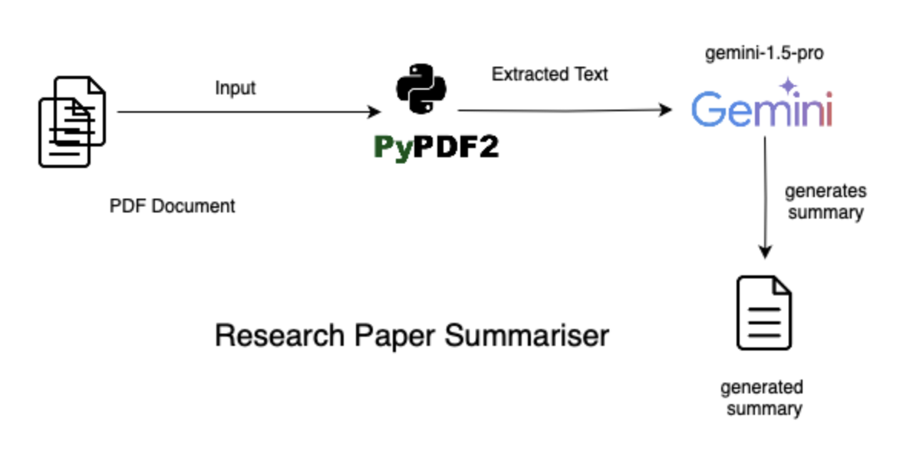

<<<<<<< HEAD
# Summarizer
=======
## Research Paper Summarizer

Many of my peers often face the challenge of going through multiple research papers with limited time. To help save time and make the research process more efficient, I built the **Research Paper Summarizer**. This tool generates a concise summary of research papers, allowing users to quickly grasp the key points before diving into the full paper.

It's deployed on Render, and while it may take a little time to load (since it's on a free tier), the summarizer works effectively to provide a quick overview of your research papers.

---

## Features

- **PDF Upload or URL Submission**: Users can either upload a PDF file or provide a URL for a research paper.
- **AI-Powered Summarization**: The app uses Google Generative AI to generate a summary of the content.
- **Responsive UI**: The app is mobile-friendly and can be accessed on different devices.
- **Deployed on Render**: Accessible online, though there might be a slight delay due to being hosted on a free tier.

---

## Tech Stack

- **Backend**: Flask
- **AI/ML**: Google Generative AI for summarization
- **PDF Processing**: PyPDF2 for reading and parsing PDFs
- **Frontend**: HTML, CSS, JavaScript
- **Deployment**: Render

---

## Architecture Overview

The architecture consists of:

- **Flask Backend**: Handles routing, file uploads, and API requests.
- **Google Generative AI**: Summarizes the content of the research papers.
- **PyPDF2**: Extracts text from uploaded PDFs.
- **Render**: Deployment platform for the web app.

### Architecture Diagram

---

## Deployment on Render

The app is live on Render. Please note that due to the free tier, it might take a few seconds for the server to wake up on the first load.

[**Live App on Render**](https://summarizer-l2ko.onrender.com)

---

## How to Use

1. **Upload PDF**: Either enter the URL of the research paper or upload a PDF directly.
2. **Generate Summary**: Click "Submit", and the summarizer will provide you with a concise summary of the research paper.
3. **Review**: Use the summary to decide whether the paper is worth reading in detail.

---

## Libraries and Tools Used

- Flask
- Google Generative AI (via `google.generativeai`)
- PyPDF2
- Requests
- dotenv
- HTML, CSS, JavaScript

---

## Contributing

If you'd like to contribute to this project, feel free to submit a pull request or create an issue on the repository. Let's make research easier and more efficient together!

---

>>>>>>> 268632a (Initial commit)
